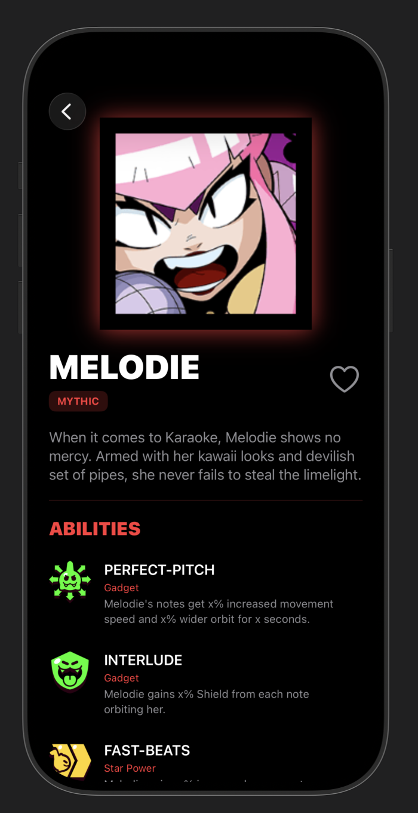
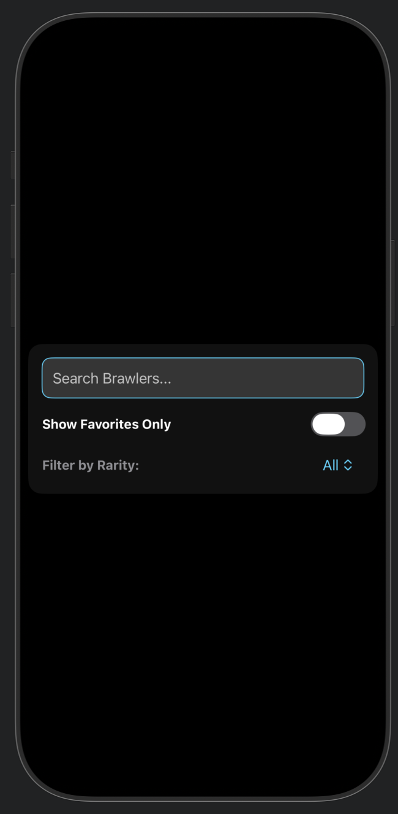

# BrawlStars-Brawler-Wiki

## App Demo

  
  
  

## Key Features
* **Active Search and Filtering:** Users can instanly lookup any bralwer by name or filter them by rarity. 
* **Favorites System:** Users can click on a heart next to the brawler name in the 'BrawlDetailView' to add them to a favorites and then show only those bralwers by clicking on a toggle.
* **Dynamic Neon Theme:** Uses a custom dark neon aesthetic that dynamically changes colors to the brawler's individual rarities. 
* **Brawl Stars Accurate Details:** Descriptions of gadgets, star powers, and brawlers are game accurate. 

## Obstacles Faced
* **Reserved Keyword in JSON data:** The BrawlAPI uses 'class' as a key variable for brawler types so I had to figure out how to get around that.
* **Cascading Errors:** When implementing the '@Published' variable in the viewModel, Xcode threw unrecognized scope errors. 

## Future Additions
* **Brawler Kit and Strategy:** Comments on the brawler's individual kits, strategies and where they work best based upon personal and pro opinions and experiences.
* **More Stats:** The current API lacks a lot of information such as the base states of the brawlers and a newer feature. So the implementation of either a supplemental or new API with more comprehensive data. 

